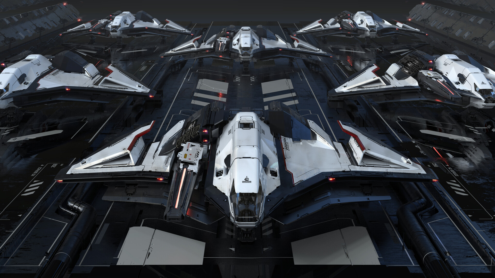
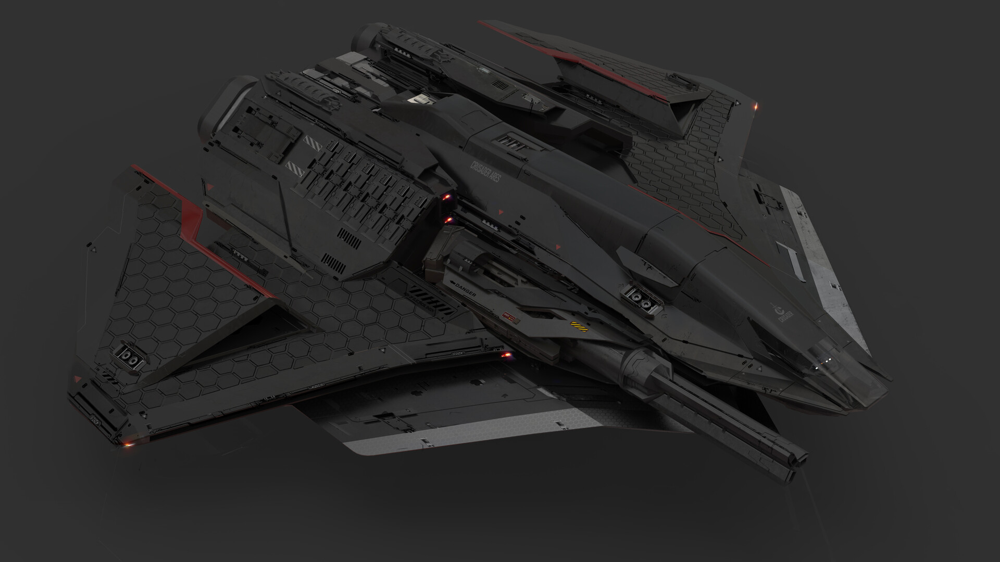
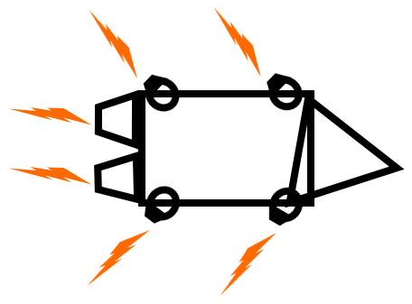

+++
title = 'Arcade: Game Design Document'
date = 2023-09-01
draft = false
+++

Copyright, Rian Rutherford, 2024, All rights reserved.

_This is a live document and continues to have edits._

> ^ Concept art by Gavin Rothery [source](https://www.artstation.com/artwork/bKXE2G).

# Concept & Gameplay

You pilot an agile spaceship in 3D person that flies like an RC drone. You fight in a platoon of three people against two other platoons (3v3v3), using different homing and lock on projectiles, or weapons, to shoot down opponents in chaotic fights with lots of explosions.

This game was inspired from [Demise]().

# Game Design Pillars

1. **Omnidirectional Movement**: The abiltiy to move in all directions, forward, backward, up, down, diagonal, etc...
2. **Homing Projectiles**: Most weapons in the game should be missiles that target the closest target. That includes, spaceships and other missiles.
3. **Spaceships**: You control what looks like spaceship merged with a sci-fi drone as your player character.
4. **Simple Controls**: The input controls must be simple enough that someone can learn how to move and shoot within 5 minutes or less.
5. **Counter Shooting**: The player should be able to shoot down any projectile heading directly towards them using any projectile/missile they have equipped.

# Design Philosophy

1. Gameplay should feel arcade like in the sense of quick & short action.
2. Simple controls, even someone who doesn't play games should be able to play too.
3. Weapns should use lock on or homing mechanics.
4. Projectiles can't be fast. They need to be faster than player movement to kill players, but slow enough that you can react in some way.
5. Everything should be clearly telegraphed and give the player time to react or process, this includes a death they cannot escape. Death isn't fun when it's instant, but it funny when you are given the freedom to observe and/or move about without being able to affect the outcome.
6. The player should spend as little time dead as possible. Death timers should not be more than 5 seconds probably. _This is dependant on many factors and isn't a hard rule._
7. Target gameplay duration of a match should be approximately 10 minutes.

# Target Platforms

1. Windows
2. Linux
3. PS4
4. PS5
5. Xbox
6. Steam Deck
7. Switch (Not required, but preferrable if possible)

# Tech Stack & Implementation

1. Client/Game Engine - Godot
2. Server - made using [Rust](https://www.rust-lang.org/) with minimal dependencies.
3. No physics engine/runtimes will be used on the server or client.
4. Server authoritative gameplay.

# Game Mechanics & Features

##### Omnidirectional Movement

Spaceships should be able to move in all directions including backwards just like with quadcopter drones. Different spaceships will be better at moving in certain directions, certain atmospheres, etc... This does not mean you can't move in a certain direction, but your spaceship and environment will affect movement speed or drift in certain directiosn, etc... 

The omnidirectional movement will be based on the original inspiration [Demise](). Drone FPV videos are also a good example of what this might look like:





##### Physics Inspired Movement

Spaceships have their movement based on multiple variable like velocity, acceleration, air friction, etc... Different spaceships have different configurations creating advantages and disadvantages based on play style, map, or location in the map.

##### Counter Measures

You should be able to shoot down/destroy other projectiles, including your own and your teammate's with your projectiles. When this happens an explosion or other VFX should happen.

##### Loadouts

Unique combinations of projectiles can be used. Spaceships will have a carrying capacity, and they can select which guns, missiles, etc... they want to carry. When selecting a missile type, gun, etc... they can choose how the ammo capacity for the individual guns/missiles are divided up.

For example a player could do: 10 Standard Missiles, or x4 Standard Missiles & x2 Micro Nuke Missiles.

_Note - the player's loadout won't change during gametime unless it is a mechanic that's part of the gamemode._

##### Limited Ammo

All ammunitions are limited, and you must collect more from points of interest on the map. This allows for resource management and planning of flight paths by the player.

When spawning the player should have an estimated 1/3 their maximum capacity of ammo. This allows for the player to be effective, but also rewards players who stay alive longer and control points of interest on the map to have an ammunition advantage.

Collecting more ammo will likely be done via some sort of pickup, this is because it creates an opening of vunerability when a player has to fly a predictable path, making them an easy target for other players.

##### Dual Piloting

When testing [Demise]() at the Falmouth Games Expo, I found parents would sometimes dual pilot. One person might control when to shoot, and the other would control movement. I believe this could be made an interesting game mechanic.

This mechanic would work in the same way as having two TV remotes and fighting over which channel to watch with your sibling. Both players have full controls and could control the spaceship solo, but they're also able to work together and delegate between them who's controlling what.

_The implementation would likely work by allowing two people to use input from different controllers if they're playing from the same device. Getting this to work for two players connected over the internet would have to be experimented with. If the game doesn't do movement prediction and all movement is calculated on the server, then this would be really easy to do for players connected over the internet too._

# Graphics & Aesthetic

Undecided and requires experimentation, one option is the stylized high definition inspired route. Could be low-poly, high definition, etc... The map would be a mix of realism and arcade/arena with holographics for ammo top ups and other objectives.

The game should target laptop hardware to make it widely accessible.

(This subject should be expanded, or an art bible created, when there is a better idea of art direction.)

##### Default Spaceship Design

I think this shapeship shape/silhouette would be cool for the base/default spaceship in the game:

> Images from [Crusader Ares Starfighter concept for Star Citizen.](https://www.artstation.com/artwork/bKXE2G)

##### Eye Thrusters

Because the spaceships are omnidirectional, they should have 8 or more steering thrusters that look like eyes. These thrusters can pivot inside their sockets based on the direction the player is moving.

Example image of a spaceship from the side. As you can see it has eye thrusters that are turning backward to help with going forward. If the player was trying to slow down, then they would face forward.

# Gamemodes

1. 3v3v3 - player vs player.
2. Free for all, 4-8 players all kill each other without teams.
3. Potential for a singleplayer or multiplayer PvE campaign will be investigated/tested, but is not part of the original main game loop.

Friendly fire should be a toggleable option for matches, and 3v3v3 is the primary/core game mode.

# Demo Plans

Intend on releasing a game demo. The demo will have one spaceship, and 1 or 2 available weapons along with access to the core game mode (3v3v3). Players will be unable to unlock anything, and do not a time limit on how long they can play the demo for.

The demo will essentially operate as a permenant free tier for the game with access to the live servers, and they will play alongside other demo players and players who bought the game and have unlocked content.

# Monetisation

##### Game Target Price

Probably want the game price range to be somewhere between £5 to £15. The game might be slightly more expensive than other indie games with the same amount of content because this game has ongoing server costs. The game will need to keep servers running for a few years with one time purchases, so this must be factored into the games price.

##### Paid Custom Skins

There is no intention for conventional micro transations at the moment, but it might be worth giving players the option to upload custom skins for their spaceships for a fee or subscription. The biggest problem with this would probably be moderation of custom skins. But this feature can probably also be done for free with no server costs, so I'm unsure.