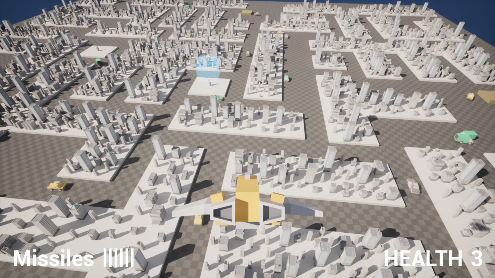
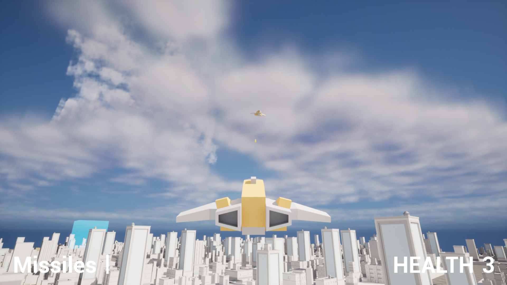
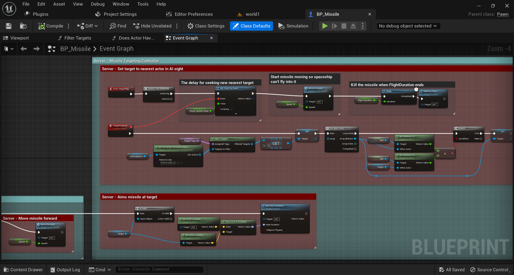
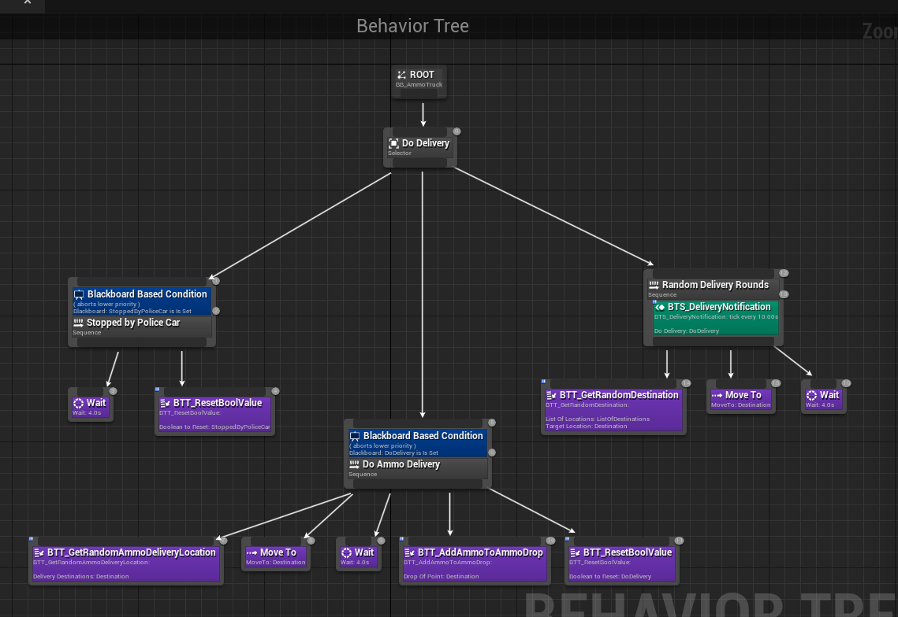

+++
title = 'Demise'
date = 2022-12-22
draft = false
+++

> ^ All the cars in this photo are using AI to navigate the city and do their own tasks. 

# About the Project

> ^ The player is shooting another player with a homing missile. The missile is the little yellow dot on the screen between the two spaceships.

I made this game solo around Christmas of *2022* during my 2nd year of university for an assignment. It’s 3D spaceship PvP demo that works on LAN.

All the net-code and AI is made in Blueprints.

# The Inner Workings of Demise

I made the spaceship shoot missiles that chase the nearest target. The target can be spaceships, other missiles, or green trucks.

I wanted missiles to only see what’s in front of them, to do this I used the *AIPerception* component and custom Blueprint (BP) code to get the nearest target in vision.

> ^ This is the code that controls the AI perception (targeting system) on the missile. 

For the city I populated it with cars that have different AI.

All cars have a wondering mechanic to drive to random locations. The police car and green van variants expand this logic.

- Police cars will randomly chase and stop other cars or vans.
- Green vans will stop at certain towers to put ammo back on the map so a spaceship can get more ammunition.

> ^ Behavior tree of the green van (ammo truck) that controls its AI.