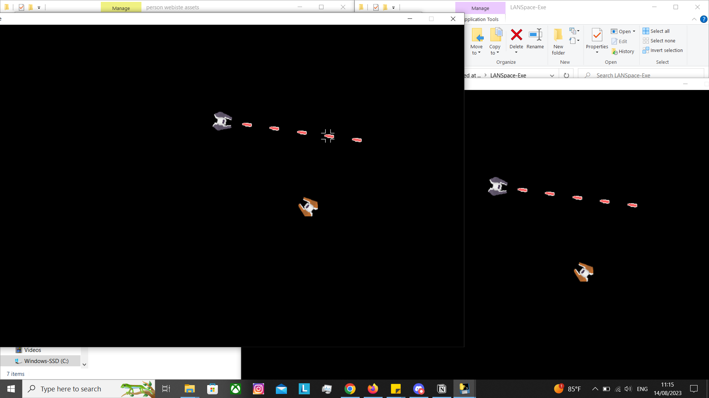

+++
title = 'LANSpace'
date = 2021-08-28
draft = false
+++


> ^ Picture showing 2 games running in the same PC on LAN.

[Repository](https://github.com/codercommand/LANSpace)

In *2021 Falmouth University* advised all programming students to make a 2D game using Python and Pygame before starting their course in September.

I decided to make mine a multiplayer spaceship game, and use a unique way of communicating I had theorised. The purpose of this was to experiment with a different communication method to make a game that doesn’t need a server or a host to work.

The end result was anyone can join or leave the local area network (LAN) at any time without negatively interrupting the experience of other players. The player limit for the LAN is 255 players technically, but in practice it only works with about 20 players on LAN before the LAN begins to suffer networking issues.

While this style of network design has drawbacks, I’m pleased that the experiment was successful.


# The Inner Workings of LANSpace

To network the game I use the UDP Broadcast protocol. Every client listens to port 8080 for other clients already on the network. After learning who is on the network, the client will assign itself a unique number and begin broadcasting its world position and other data on port 8080.

All the clients listen for broadcasts and render the players who are broadcasting.

A death in the game is simulated by not broadcasting the player position. If a client doesn’t receive an update to the location of a player within 0.03 seconds, then the player is removed from their game. Respawning is as simple as broadcasting the player position again.

```python
# A generator used for reading the game network before each game loop.
def network_reader(main_player_id: int) -> list:
...
...
...
		# Removes enemies that have stopped playing for more than 1 second.
		for x in range(len(game_state)-1, -1, -1):

				# Remoevs enemy players that have quit playing.
				if game_state[x].type == Type.Actor:
						if (time.time() - game_state[x].last_update) > 0.03:
								game_state.pop(x)
								continue
```
> ^ Code that controls which players are rendered to the screen.

I also made functions to serialized and deserialized player data (like position) from and to bytes. I did this to reduce packet size and because it was fun. There was also a performance concern. I believed it to be faster to have custom serialization code built to purpose instead of processing text or JSON.

```python
# Base type used to make the two seperate player types: Avatar & Player.
class Actor:
    def __init__(self, id: int, _type: Type, rotation: int, x: int, y: int, shiptype: int) -> None:
        self.type =     _type
        self.id =       id
        self.rotation = rotation # I only want to store 0-360 in rotation, nothing other.
        self.x =        x
        self.y =        y
        self.shiptype = shiptype # Ship type must be between and including 1-4

        self.spaceship_cache = None
        self.size = 42

    def to_bytes(self) -> bytes:
        data = []

        data.append(self.type)
        data.append(self.id)
        for x in self.rotation.to_bytes(length=2, byteorder="big", signed=False):
            data.append(x)
        for x in int(self.x).to_bytes(length=4, byteorder="big", signed=False):
            data.append(x)
        for x in int(self.y).to_bytes(length=4, byteorder="big", signed=False):
            data.append(x)
        data.append(self.shiptype)

        return bytes(data)

    def from_bytes(self, data: bytes) -> None:
        self.type =     data[0]
        self.id =       data[1]
        self.rotation = int.from_bytes(data[2:4], byteorder="big", signed=False)
        self.x =        int.from_bytes(data[4:8], byteorder="big", signed=False)
        self.y =        int.from_bytes(data[8:12], byteorder="big", signed=False)
        self.shiptype = data[12]
```
> ^ Code showing the custom serialisation and deserialisation functions I made for the player.


# Flaws with LANSpace

It’s really easy to cheat because there is no authority for the network state, everyone is responsible for their individual character state. For example, to make your player immortal you would continue to broadcast you ships position, this would make you immune to damage because on everyone else's screens you would never die. The game is intended to be played on LAN though so it’s not a big concern. You would be playing with friends or people you know so if you’re cheating it’s because you and your friends want to.

The other problem is that because the game is broadcasting to everyone on the network it has the potential to use up all the bandwidth available for every device. This causes the internet to become slow, similar to a denial of service attack. On testing: 20 players is fine, you can get away with 50, anything higher and the network can’t handle it. The internet will stop working properly with anything over ~80 for everyone connected, including people not playing the game.