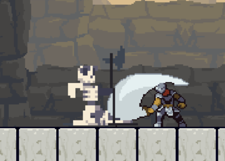
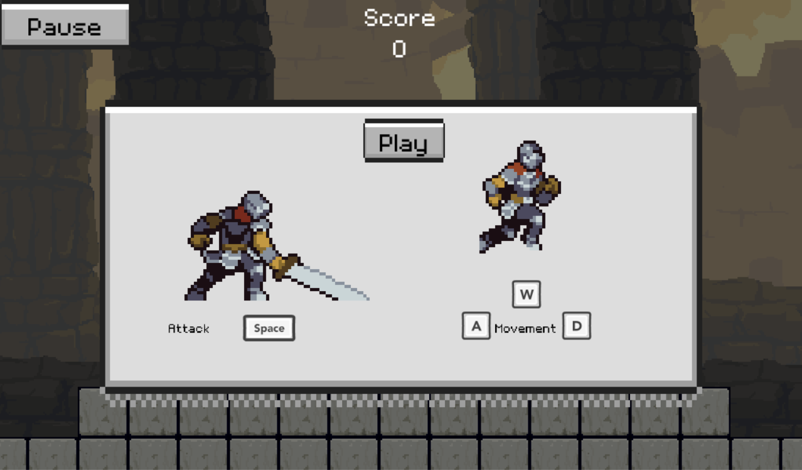
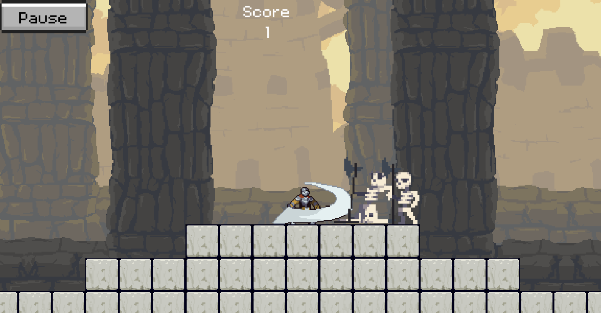
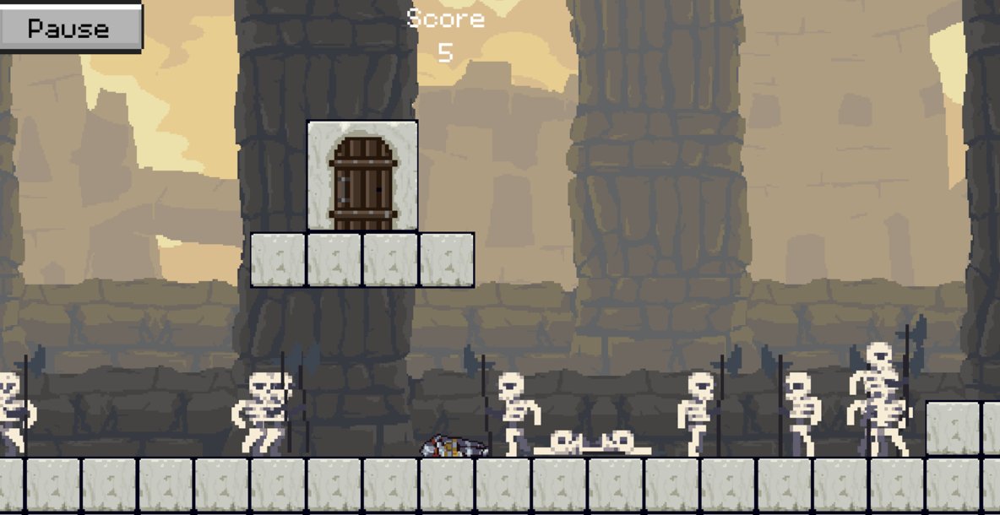

+++
title = 'Sentinel'
date = 2022-01-31
draft = false
+++




# About the Project

While doing my 1st year of university in 2022, I participated in a game jam on [itch.io](http://itch.io). It was a 72 hour jam with a theme of ***protect***.

I made the game solo in Godot and used GDScript. This is the 3rd project I’ve ever made in Godot. All the assets for the project are from [itch.io](http://itch.io).

The game loop is simple, kill skeletons till you die then repeat and try to beat your last high score. Current record is by someone else who played the game. Their record is 1483.


> ^ Picture of the main menu.


> ^ Picture of player killing a skeleton. There is also a dead skeleton on the ground.


> ^ Picture of dead player.


# Code Snippets

This is some ***GDScript*** code snippets from the player script.

```cpp
func _process(delta):
	if not died:
		input_controller()
		attack_enemy_controller()
		animation_controller()
		physics_controller(delta)
		
		velocity = move_and_slide(velocity, Vector2.UP)
		
		levelup()
```
> ^ The *update* function. Logic for the player uses a state machine separated between multiple functions. These functions are all called from the player *update* function.

```cpp
func animation_controller():
	"""
	animation_controller is an animation statemachine.
	It controls which animations should be playing based on player input.
	"""
	
	if not animation_locked and not died:
		if dead:
			$AnimatedSprite.animation = "death"
			animation_locked = true
			died = true
			$RunAudio.stop()
			
			$DeathTimer.start()
			
		elif not is_on_floor() and $AnimatedSprite.animation == "jump":
			$AnimatedSprite.animation = "jumpTransition"
			animation_locked = true
			
		elif not is_on_floor():
			$AnimatedSprite.animation = "fall"
			$RunAudio.stop()
			
		elif jumping and is_on_floor():
			$AnimatedSprite.animation = "jump"
			animation_locked = true
			$RunAudio.stop()
			
		elif attacking:
			$AnimatedSprite.animation = get_attack_animation()
			animation_locked = true
			$AttackAudio.play()
			$RunAudio.stop()
			
		elif running:
			$AnimatedSprite.animation = "run"
			if not $RunAudio.playing:
				$RunAudio.play()
			
		else:
			$AnimatedSprite.animation = "idle"
			$RunAudio.stop()
```
> ^ This is the function responsible for handling the player animations. The logic is all state based, and is called in the code snippet above that shows the player *update* function.